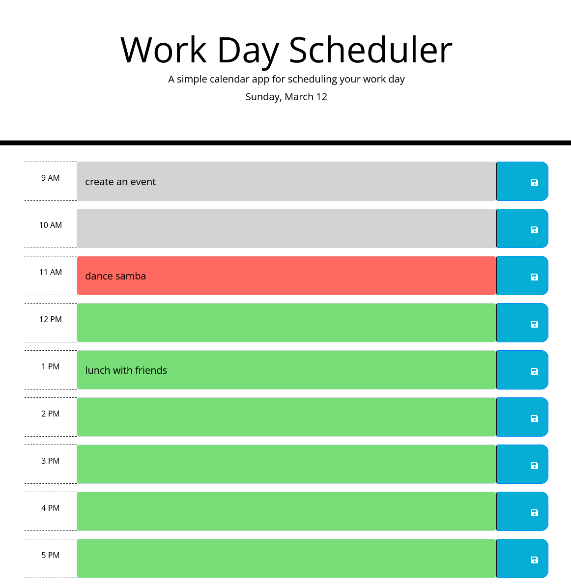

# README FILE GENERATOR

[](https://opensource.org/licenses/MIT)


## 🚩 TABLE OF CONTENT

- [Description](#-description)
- [Usage](#-usage)
- [Technology used](#-technology-used)
- [Installation](#-installation)
- [Credits](#-credits)
- [License](#-license)

## 📖 DESCRIPTION

### 🎯 What is it about?

This is a simple calendar application that allows a user to save events for each hour of the day (business hours).

### 🔍 Preview

The following image shows the web application's appearance and functionality:



## 💻 USAGE

### 💬 User story

```
AS AN employee with a busy schedule
I WANT to add important events to a daily planner
SO THAT I can manage my time effectively
```

### 💬 Main functionalities

This app runs in the browser and features dynamically updated HTML and CSS powered by jQuery. I modified the starter code so that the app:

- [x] Displays the current day at the top of the calender when a user opens the planner.
- [x] Presents timeblocks for standard business hours when the user scrolls down.
- [x] Color-codes each timeblock based on past, present, and future when the timeblock is viewed.
- [x] Allows a user to enter an event when they click a timeblock
- [x] Saves the event in local storage when the save button is clicked in that timeblock.
- [x] Persists events between refreshes of a page

## ✅ TECHNOLOGY USED

- HTML5
- CSS3
- Bootstrap
- Javascript
- JQuery
- Moment.js library to work with date and time.

## 🚀 INSTALLATION

No installation required.

## 💬 CREDITS

- A big thank you to my tutor A. for helping me refresh my knowledge of event listeners.
- Thank you to my classmate Ingrid B. for the collaboration and debugging session.

## 📃 LICENSE

This application is covered under MIT License.
